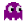
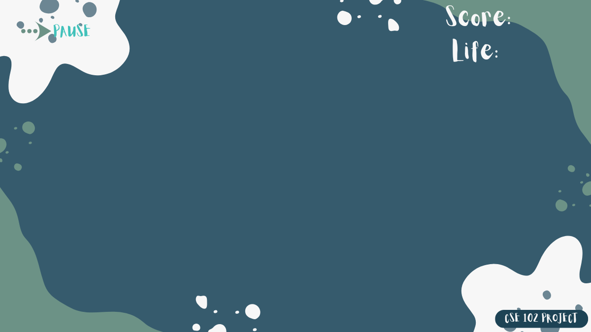

  <h1>
    PAC-MAN: RETRO REIMAGINED
  </h1>

  
<em>A tribute to the timeless classic, built from scratch in C with <code>iGraphics.h</code></em>

  

    
    
  

<h2 style="font-family: 'Segoe UI', sans-serif; color: #333;">🎮 Authors</h2>
<ul style="font-size: 16px;">
    <li><strong>Md Ratul Hasan</strong> — CSE'24</li>
    <li><strong>Hasibul Islam</strong> — CSE'24</li>
</ul>

<h3 style="color: #555;">🧭 Guided by</h3>

Abdur Rafi

<h2 style="font-family: 'Segoe UI', sans-serif; color: #333;">⚙️ Settings Menu</h2>

    The game includes a dedicated <strong>Settings</strong> screen where players can personalize their experience before
    diving into the maze. Designed with clarity and style, this menu offers:

<ul style="font-size: 16px; color: #444;">
    <li><strong>🔊 Sound Toggle:</strong> Switch between <em>ON</em> and <em>OFF</em> to suit your vibe.</li>
    <li><strong>🧩 Maze Selection:</strong> Choose from multiple maze layouts for varied gameplay.</li>
    <li><strong>🔙 Back Button:</strong> Seamlessly return to the main menu with a single click.</li>
</ul>

<h2 style="font-family: 'Segoe UI', sans-serif; color: #333;">🧱 Maze Brick Designs</h2>

    Choose your battlefield! The game features <strong>eight uniquely crafted mazes</strong>, each with its own brick
    pattern and gameplay twist.

<ul style="font-size: 16px; color: #444;">
    <li><strong>🌀 Spiral</strong></li>
    <li><strong>👻 Phantom</strong></li>
    <li><strong>🔮 Nebula</strong></li>
    <li><strong>💥 Pixel Pulse</strong></li>
    <li><strong>🧠 Psi</strong></li>
    <li><strong>🌊 Echo</strong></li>
    <li><strong>⚡ Crack</strong></li>
    <li><strong>👁️ Spectral</strong></li>
</ul>
<h2>🧩 Maze Gallery</h2>

    
    
    
    
    
    
    
    

<h2 style="font-family: 'Segoe UI', sans-serif; color: #333;">🔥 Difficulty Levels</h2>

    Four challenge tiers to suit every player:

<ul style="font-size: 16px; color: #444;">
    <li><strong>🟢 Easy</strong></li>
    <li><strong>🟡 Medium</strong></li>
    <li><strong>🔵 Hard</strong></li>
    <li><strong>🔴 Extreme</strong></li>
</ul>
<section id="difficulty">
    <h2>Difficulty & Progression</h2>
    <table>
        <tr>
            <th>Mode</th>
            <th>Ghost Speed</th>
            <th>Pac Speed</th>
            <th>Behavior</th>
        </tr>
        <tr>
            <td>Easy 🟢</td>
            <td>2</td>
            <td>3</td>
            <td>Basic chase</td>
        </tr>
        <tr>
            <td>Medium 🟡</td>
            <td>3</td>
            <td>3</td>
            <td>Standard AI</td>
        </tr>
        <tr>
            <td>Hard 🔵</td>
            <td>4</td>
            <td>3</td>
            <td>Advanced prediction</td>
        </tr>
        <tr>
            <td>Extreme 🔴</td>
            <td>4</td>
            <td>4</td>
            <td>“Blast” chaining</td>
        </tr>
    </table>
</section>

<h2 align="center">📜 Game Rules</h2>

<table align="center" width="100%" cellspacing="10">
  <tr>
    <td width="60"></td>
    <td><strong>🎯 Eat all pellets</strong> Avoid ghosts and navigate through the maze to survive.</td>
  </tr>
  <tr>
    <td></td>
    <td><strong>🍒 Power Pellets</strong> Make ghosts vulnerable for a short time—use them strategically.</td>
  </tr>
  <tr>
    <td></td>
    <td><strong>🧠 Ghost Intelligence</strong> Ghosts become smarter and faster as your score increases.</td>
  </tr>
  <tr>
    <td></td>
    <td><strong>💾 High Scores</strong> Your score and name are saved locally in <code>player_name.txt</code>.</td>
  </tr>
</table>

<h2>📜 Playing Rules</h2>

<ul>
  <li><strong>🟡 Pac-Man Movement:</strong> Use arrow keys to navigate freely through the maze grid. Movement is pixel-aligned for smooth transitions and corner detection.</li>
  
  <li><strong>👻 Ghost Behavior:</strong>
    <ul>
      <li>Ghosts begin in <em>scatter mode</em> and later switch to <em>chase mode</em> based on difficulty and elapsed time.</li>
      <li>Each ghost has unique AI patterns:
        <ul>
          <li><strong>Blinky</strong> – Directly follows Pac-Man’s current position.</li>
          <li><strong>Pinky</strong> – Predicts the player’s next move to intercept.</li>
          <li><strong>Inky</strong> – Uses dual-position targeting for erratic movement.</li>
          <li><strong>Clyde</strong> – Wanders with randomized turns.</li>
        </ul>
      </li>
      <li>Ghosts switch to vulnerable mode when power pellets are eaten.</li>
    </ul>
  </li>

  <li><strong>🍽️ Food & Fruit System:</strong>
    <ul>
      <li>Each pellet eaten adds <code>+10</code> to score.</li>
      <li>Fruit spawns intermittently based on <code>foodhelp % fruitTimeInterval == 0</code>.</li>
      <li>There are <strong>16 fruit types</strong>, selected randomly via <code>randGen</code>.</li>
      <li>Consuming <strong>fruit #12 or #15</strong> grants an extra life.</li>
    </ul>
  </li>

  <li><strong>⚡ Power Pellets:</strong>
    <ul>
      <li>Trigger ghost vulnerability mode.</li>
      <li>Timer-based reset restores ghosts to original behavior.</li>
    </ul>
  </li>

  <li><strong>💔 Death Logic:</strong>
    <ul>
      <li>Collision with a non-vulnerable ghost decreases <code>life</code>.</li>
      <li>Pixel-based proximity detection ensures accurate hits.</li>
      <li>Animation sequences play on death and respawn.</li>
    </ul>
  </li>

  <li><strong>🎯 Win & Loss Conditions:</strong>
    <ul>
      <li>Win by clearing the entire maze of pellets and fruits.</li>
      <li>Lose by running out of lives.</li>
      <li>Final score recorded in <code>player_name.txt</code>.</li>
      <li>“Congratulations” or “Game Over” screen displays based on outcome.</li>
    </ul>
  </li>
</ul>

<h2 style="font-family: 'Segoe UI', sans-serif; color: #333;">🏆 High Score Board</h2>
<ul style="font-size: 16px; color: #444;">
    <li>📋 Displays top 6 players</li>
    <li>💾 Saved with file I/O</li>
    <li>🔄 Sorted automatically</li>
</ul>

<h2 style="font-family: 'Segoe UI', sans-serif; color: #333;">✍️ Name Entry Screen</h2>

    Your name defines your legacy:

<ul style="font-size: 16px; color: #444;">
    <li>⌨️ Keyboard input support</li>
    <li>💾 Stored with your score</li>
    <li>🧼 Validated in real-time</li>
</ul>

<h2 style="font-family: 'Segoe UI', sans-serif; color: #333;">🏗️ Maze Progression Levels</h2>
<ul style="font-size: 16px; color: #444;">
    <li>🔰 Level 1 — Initiation</li>
    <li>⚙️ Level 2 — Escalation</li>
    <li>🧠 Level 3 — Strategy</li>
    <li>💀 Level 4 — Survival</li>
</ul>

🌌 Maze Progression

<table>
    <tr>
        <th>Maze</th>
        <th>Size</th>
        <th>Dots</th>
        <th>Ghosts</th>
        <th>Highlights</th>
    </tr>
    <tr>
        <td>Maze 1</td>
        <td>21×21</td>
        <td>226</td>
        <td>4</td>
        <td>Classic style</td>
    </tr>
    <tr>
        <td>Maze 2</td>
        <td>21×21</td>
        <td>236</td>
        <td>4</td>
        <td>Challenging layout</td>
    </tr>
    <tr>
        <td>Maze 3</td>
        <td>19×36</td>
        <td>362</td>
        <td>6</td>
        <td>Includes Rinky & Donky</td>
    </tr>
    <tr>
        <td>Maze 4</td>
        <td>21×40</td>
        <td>454</td>
        <td>6</td>
        <td>Blast mode ghosts</td>
    </tr>
</table>

<h2 style="font-family: 'Segoe UI', sans-serif; color: #333;">🟢 Power Pellet System</h2>
<ul style="font-size: 16px; color: #444;">
    <li><strong>Quantity:</strong> 4 per maze</li>
    <li><strong>Size:</strong> 8 pixels radius</li>
    <li><strong>Variant:</strong> Green pellets trigger extended ghost vulnerability</li>
    <li><strong>Effect:</strong> Ghosts become edible for ~10 seconds</li>
</ul>

<h2 style="font-family: 'Segoe UI', sans-serif; color: #333;">🌌 Background Themes</h2>

    Six vivid backgrounds enhance immersion:

<ul style="font-size: 16px; color: #444;">
    <li>🎮 Code Nest</li>
    <li>🌠 Syntax Splash</li>
    <li>🧊 Hollow </li>
    <li>🔥 Crimson Circuit</li>
    <li>🌿 Leafscape </li>

</ul>
<<h2>🍓 Fruit Bonus Gallery (16 Variants)</h2>

<table>
  <tr>
    <td></td>
    <td></td>
    <td></td>
    <td></td>
    <td></td>
    <td></td>
    <td></td>
    <td></td>
  </tr>
  <tr>
    <td></td>
    <td></td>
    <td></td>
    <td></td>
    <td></td>
    <td></td>
    <td></td>
    <td></td>
  </tr>
</table>

🍒 <strong>Special Bonus:</strong> Fruit 12 and Fruit 15 grant extra life when consumed. Others contribute to score progression and trigger game events based on intervals.

<h2 style="font-family: 'Segoe UI', sans-serif; color: #333;">🍓 Fruit Bonus System</h2>
<ul style="font-size: 16px; color: #444;">
    <li>🕒 Fruits spawn every 600 ticks</li>
    <li>🍇 16 fruit types</li>
    <li>💎 Bonus effects: +1000 points or +1 life for rare fruits</li>
</ul>

<h2 style="font-family: 'Segoe UI', sans-serif; color: #333;">👻 Ghost Modes</h2>
<ul style="font-size: 16px; color: #444;">
    <li>😴 Scatter — passive patrol</li>
    <li>🎯 Chase — score-based aggression</li>
    <li>💥 Blast — coordinated final pursuit</li>
</ul>
<h2>👻 Ghost Character Table</h2>

<table border="1" cellpadding="10" cellspacing="0">
    <thead>
        <tr>
            <th>Image</th>
            <th>Name</th>
            <th>Type</th>
            <th>Characteristic</th>
        </tr>
    </thead>
    <tbody>
        <tr>
            <td></td>
            <td>Blinky</td>
            <td>Chaser</td>
            <td>Relentless pursuit of Pac-Man, direct pathfinding</td>
        </tr>
        <tr>
            <td></td>
            <td>Pinky</td>
            <td>Ambusher</td>
            <td>Predicts player’s future location to intercept</td>
        </tr>
        <tr>
            <td></td>
            <td>Inky</td>
            <td>Flanker</td>
            <td>Uses dual-point tracking for unpredictable behavior</td>
        </tr>
        <tr>
            <td></td>
            <td>Clyde</td>
            <td>Wanderer</td>
            <td>Random movement with passive targeting logic</td>
        </tr>
        <tr>
            <td></td>
            <td>Pookie</td>
            <td>Strategist</td>
            <td>Stylized wall-hugger with maze-aware turns</td>
        </tr>
        <tr>
            <td></td>
            <td>White-Eyed Specter -Eatable</td>
            <td>Variant</td>
            <td>Turns aggressive on hard difficulty, scary pursuit</td>
        </tr>
         <tr>
            <td></td>
            <td>Red-Eyed Specter</td>
            <td>Variant</td>
            <td>Turns aggressive on hard difficulty, scary pursuit</td>
        </tr>
        <tr>
            <td></td>
            <td>Green Ghost</td>
            <td>Neutral/Boss</td>
            <td>Bonus role or frozen state, mysterious movement</td>
        </tr>
    </tbody>
</table>
<h2>🌌 Background Selector</h2>

Customize your Pac-Man world by choosing from five distinct background styles. Each provides unique ambiance while keeping gameplay mechanics unchanged.

<table>
  <tr>
    <td align="center">
       <strong>🧪 Syntax Splash</strong> <em>Teal overlays with scientific energy</em>
    </td>
    <td align="center">
       <strong>🔌 Crimson Circuit</strong> <em>Black-red theme for intensity</em>
    </td>
    <td align="center">
       <strong>🍃 Leafscape</strong> <em>Soft, nature-inspired vibe</em>
    </td>
  </tr>
  <tr>
    <td align="center">
       <strong>🌫️ Hollow</strong> <em>Mystical mist and shadow play</em>
    </td>
    <td align="center">
       <strong>🖥️ Code Nest</strong> <em>Warm coding desk, student’s vibe</em>
    </td>
  </tr>
</table>

  
<strong>💯 Scoring System</strong>

   

  <table border="1" cellpadding="8" cellspacing="0" style="border-collapse: collapse; text-align: center; width: 100%; font-size: 16px;">
    <thead style="background-color: #ffe680;">
      <tr>
        <th>🏁 Action</th>
        <th>📈 Points</th>
        <th>🔍 Description</th>
      </tr>
    </thead>
    <tbody>
      <tr>
        <td>🔹 Regular Dot</td>
        <td>+10</td>
        <td>Standard pellets scattered throughout the maze</td>
      </tr>
      <tr>
        <td>⚡ Power Pellet</td>
        <td>+40</td>
        <td>Enables ghost vulnerability for a short time</td>
      </tr>
      <tr>
        <td>🍓 Fruit Bonus</td>
        <td>+1000</td>
        <td>Appears at timed intervals, type varies</td>
      </tr>
      <tr>
        <td>👻 Blue Ghosts (Combo)</td>
        <td>+100 → +300 → +900 → +2700</td>
        <td>Chomp ghosts while they’re blue! Score grows with consecutive hits</td>
      </tr>
      <tr>
        <td>🏁 Maze Completion</td>
        <td>+2000</td>
        <td>Clearing all food and fruit from the maze triggers bonus</td>
      </tr>
      <tr>
        <td>🍒 Fruit Chain</td>
        <td>~Extra Life</td>
        <td>Time-based chain eating triggers high bonus burst</td>
      </tr>
    </tbody>
  </table>

    
    
<em>This isn’t just Pac-Man. It’s your version of arcade perfection.</em>
    

<h2 style="font-family: 'Segoe UI', sans-serif; color: #333;">🧩 Code Documentation</h2>

<h3 style="color: #555;">🏗️ Structures</h3>
<ul style="font-size: 16px; color: #444;">
    <li><strong>pacmove</strong>: Controls Pac-Man's movement states and animations. Includes direction flags, indexes,
        and smoothing logic.</li>
    <li><strong>ghost</strong>: Controls ghost behavior — position, direction, animation indices, vulnerability
        (blueOn), pathfinding distance values, and speed.</li>
</ul>

🔢 Total Ghosts Used:
<ul>
    <li>4 ghosts in maze 1 and 2: Inky, Blinky, Pinky, Clyde</li>
    <li>6 ghosts in maze 3 and 4: +Donky and Rinky</li>
</ul>

<h3 style="color: #555;">🛠️ Key Functions</h3>
<ul style="font-size: 16px; color: #444;">
    <li><strong>pacmanmovement()</strong>: Updates Pac-Man’s position and animation based on directional input.</li>
    <li><strong>pookiemovement()</strong>: Handles movement and behavior of all ghosts depending on maze, score, and AI
        mode.</li>
    <li><strong>drawMaze1/2/3/4()</strong>: Renders brick layouts using `iShowImage` for each specific maze based on
        wall logic.</li>
    <li><strong>drawFoodAndPowerPellet()</strong>: Draws regular food, power pellets, and fruit based on position and
        status flags.</li>
    <li><strong>collisioncheck()</strong>: Detects food pickup, ghost collision, pellet effects, ghost eating, and game
        win conditions.</li>
    <li><strong>bluetimecheck()</strong>: Decrements blue timer and resets ghost vulnerability.</li>
    <li><strong>directionGenarator()</strong>: Assigns ghost movement based on proximity to Pac-Man (chase, scatter, or
        blast).</li>
    <li><strong>foodCoordinateStore()</strong>: Initializes food and fruit positions based on maze layout and open
        cells.</li>
    <li><strong>DataAnalysis()</strong>: Reads/writes sorted high scores using file I/O.</li>
    <li><strong>pacinitialcord()</strong>, <strong>pookieinitialcoordinate()</strong>: Sets starting positions for
        Pac-Man and ghosts per maze.</li>
</ul>

<h3 style="color: #555;">📦 Important Variables</h3>
<ul style="font-size: 16px; color: #444;">
    <li><code>pac</code>: Instance of `pacmove` controlling Pac-Man’s movement.</li>
    <li><code>pookie[6]</code>: Array of 6 ghost structs controlling AI behaviors.</li>
    <li><code>maze1 - maze4</code>: 2D integer arrays defining each maze’s wall layout.</li>
    <li><code>map1CoordinateX/Y</code>: Pixel coordinate mapping of maze 1 layout (same for other mazes).</li>
    <li><code>foodXcor, foodYcor</code>: Stores food positions and status flags (-1=eaten, -2=fruit).</li>
    <li><code>blueGhost</code>: Timer for ghost vulnerability duration.</li>
    <li><code>fruitGen[]</code>, <code>randGen</code>: Controls fruit appearance and image variant.</li>
    <li><code>selected</code>: Current maze level selector (1 to 4).</li>
    <li><code>score</code>, <code>pacScore[]</code>: Tracks current score and display value.</li>
    <li><code>pacmanlife</code>: Number of remaining lives.</li>
    <li><code>diffSpeed</code>: Speed factor adjusted by difficulty level.</li>
    <li><code>scatter</code>, <code>chase</code>, <code>blast</code>: Boolean flags controlling ghost behavior mode.
    </li>
    <li><code>mainmenu, pause, settings...</code>: Boolean state flags for UI screens.</li>
</ul>

<h3 style="color: #555;">🧠 AI Behavior Highlights</h3>
<ul style="font-size: 16px; color: #444;">
    <li><strong>Scatter Mode:</strong> Ghosts target fixed offset positions.</li>
    <li><strong>Chase Mode:</strong> Ghosts use dynamic distance comparisons and prediction logic.</li>
    <li><strong>Pinky:</strong> Predicts ahead of Pac-Man's current direction.</li>
    <li><strong>Inky:</strong> Predicts behind the current movement.</li>
    <li><strong>Clyde:</strong> Ambush behavior.</li>
    <li><strong>Donky and Rinky:</strong> Direct chasers with varied path logic.</li>
</ul>

<h3 style="color: #555;">🎮 Gameplay Flow Summary</h3>
<ul style="font-size: 16px; color: #444;">
    <li>Game initializes with intro and menu screens using timers.</li>
    <li>Player enters name — stored for high scores.</li>
    <li>Maze and difficulty are selected via UI flags.</li>
    <li>Pac-Man and ghosts are positioned and begin movement.</li>
    <li>Food items update scores and may spawn bonus fruits.</li>
    <li>Power pellets trigger ghost vulnerability timers.</li>
    <li>Ghosts respond based on player location and behavior state.</li>
    <li>Upon winning or losing, score is saved and congrats UI is shown.</li>
</ul>

    
    
<em>This is more than code — it's a full game engine tailored for C retro
            action.</em>

