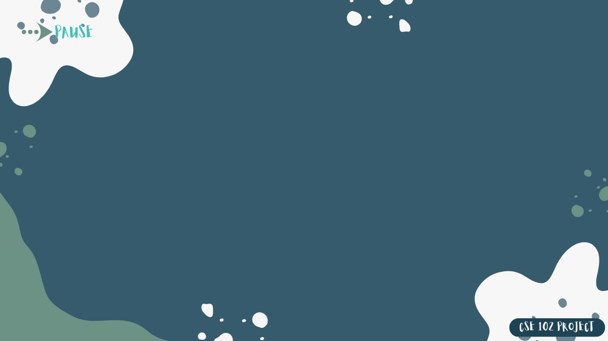

  <h1>
    PAC-MAN: RETRO REIMAGINED
  </h1>

  
<em>A tribute to the timeless classic, built from scratch in C with <code>iGraphics.h</code></em>

  

    
    
  

<h2 style="font-family: 'Segoe UI', sans-serif; color: #333;">🎮 Authors</h2>
<ul style="font-size: 16px;">
    <li><strong>Md Ratul Hasan</strong> — CSE'24</li>
    <li><strong>Hasibul Islam</strong> — CSE'24</li>
</ul>

<h3 style="color: #555;">🧭 Guided by</h3>

Abdur Rafi

<h2>🤝 Special Thanks</h2>

I owe deep gratitude to the seniors whose wisdom and contributions helped guide this project:

<ul>
  <li><strong>Abdur Rashid Tyshar</strong> — CSE-16, BUET</li>
  <li><strong>Anwarul Bashir Shuaib</strong> — CSE-18, BUET</li>
  <li><strong>Kazi Rakibul Hasan</strong> — CSE-18, BUET</li>
</ul>

  “At first, I had no idea how to get started. Later, after watching my seniors’ videos and exploring their code, I began to understand how to approach things. I followed several complex techniques from their implementations. A heartfelt thank you to them for their invaluable support.”

<h2 style="font-family: 'Segoe UI', sans-serif; color: #333;">⚙️ Settings Menu</h2>

    The game includes a dedicated <strong>Settings</strong> screen where players can personalize their experience before
    diving into the maze. Designed with clarity and style, this menu offers:

<ul style="font-size: 16px; color: #444;">
    <li><strong>🔊 Sound Toggle:</strong> Switch between <em>ON</em> and <em>OFF</em> to suit your vibe.</li>
    <li><strong>🧩 Maze Selection:</strong> Choose from multiple maze layouts for varied gameplay.</li>
    <li><strong>🔙 Back Button:</strong> Seamlessly return to the main menu with a single click.</li>
</ul>

<h2 style="font-family: 'Segoe UI', sans-serif; color: #333;">🧱 Maze Brick Designs</h2>

    Choose your battlefield! The game features <strong>eight uniquely crafted mazes</strong>, each with its own brick
    pattern and gameplay twist.

<ul style="font-size: 16px; color: #444;">
    <li><strong>🌀 Spiral</strong></li>
    <li><strong>👻 Phantom</strong></li>
    <li><strong>🔮 Nebula</strong></li>
    <li><strong>💥 Pixel Pulse</strong></li>
    <li><strong>🧠 Psi</strong></li>
    <li><strong>🌊 Echo</strong></li>
    <li><strong>⚡ Crack</strong></li>
    <li><strong>👁️ Spectral</strong></li>
</ul>
<h2>🧩 Maze Gallery</h2>

    
    
    
    
    
    
    
    

<h2 style="font-family: 'Segoe UI', sans-serif; color: #333;">🔥 Difficulty Levels</h2>

    Four challenge tiers to suit every player:

<ul style="font-size: 16px; color: #444;">
    <li><strong>🟢 Easy</strong></li>
    <li><strong>🟡 Medium</strong></li>
    <li><strong>🔵 Hard</strong></li>
    <li><strong>🔴 Extreme</strong></li>
</ul>
<section id="difficulty">
    <h2>Difficulty & Progression</h2>
    <table>
        <tr>
            <th>Mode</th>
            <th>Ghost Speed</th>
            <th>Pac Speed</th>
            <th>Behavior</th>
        </tr>
        <tr>
            <td>Easy 🟢</td>
            <td>2</td>
            <td>3</td>
            <td>Basic chase</td>
        </tr>
        <tr>
            <td>Medium 🟡</td>
            <td>3</td>
            <td>3</td>
            <td>Standard AI</td>
        </tr>
        <tr>
            <td>Hard 🔵</td>
            <td>4</td>
            <td>3</td>
            <td>Advanced prediction</td>
        </tr>
        <tr>
            <td>Extreme 🔴</td>
            <td>4</td>
            <td>4</td>
            <td>“Blast” chaining</td>
        </tr>
    </table>
</section>

<h2 align="center">📜 Game Rules</h2>

<table align="center" width="100%" cellspacing="10">
  <tr>
    <td width="60"></td>
    <td><strong>🯠Eat all pellets</strong> Avoid ghosts and navigate through the maze to survive.</td>
  </tr>
  <tr>
    <td></td>
    <td><strong>💠Power Pellets</strong> Make ghosts vulnerable for a short time—use them strategically.</td>
  </tr>
  <tr>
    <td></td>
    <td><strong>🧠 Ghost Intelligence</strong> Ghosts become smarter and faster as your score increases.</td>
  </tr>
  <tr>
    <td></td>
    <td><strong>💾 High Scores</strong> Your score and name are saved locally in <code>player_name.txt</code>.</td>
  </tr>
</table>

<h2>📜 Playing Rules</h2>

<ul>
  <li><strong>🟡 Pac-Man Movement:</strong> Use arrow keys to navigate freely through the maze grid. Movement is pixel-aligned for smooth transitions and corner detection.</li>
  
  <li><strong>👻 Ghost Behavior:</strong>
    <ul>
      <li>Ghosts begin in <em>scatter mode</em> and later switch to <em>chase mode</em> based on difficulty and elapsed time.</li>
      <li>Each ghost has unique AI patterns:
        <ul>
          <li><strong>Blinky</strong> – Directly follows Pac-Man’s current position.</li>
          <li><strong>Pinky</strong> – Predicts the player’s next move to intercept.</li>
          <li><strong>Inky</strong> – Uses dual-position targeting for erratic movement.</li>
          <li><strong>Clyde</strong> – Wanders with randomized turns.</li>
        </ul>
      </li>
      <li>Ghosts switch to vulnerable mode when power pellets are eaten.</li>
    </ul>
  </li>

  <li><strong>🍽️ Food & Fruit System:</strong>
    <ul>
      <li>Each pellet eaten adds <code>+10</code> to score.</li>
      <li>Fruit spawns intermittently based on <code>foodhelp % fruitTimeInterval == 0</code>.</li>
      <li>There are <strong>16 fruit types</strong>, selected randomly via <code>randGen</code>.</li>
      <li>Consuming <strong>fruit #12 or #15</strong> grants an extra life.</li>
    </ul>
  </li>

  <li><strong>⚡ Power Pellets:</strong>
    <ul>
      <li>Trigger ghost vulnerability mode.</li>
      <li>Timer-based reset restores ghosts to original behavior.</li>
    </ul>
  </li>

  <li><strong>💔 Death Logic:</strong>
    <ul>
      <li>Collision with a non-vulnerable ghost decreases <code>life</code>.</li>
      <li>Pixel-based proximity detection ensures accurate hits.</li>
      <li>Animation sequences play on death and respawn.</li>
    </ul>
  </li>

  <li><strong>🎯 Win & Loss Conditions:</strong>
    <ul>
      <li>Win by clearing the entire maze of pellets and fruits.</li>
      <li>Lose by running out of lives.</li>
      <li>Final score recorded in <code>player_name.txt</code>.</li>
      <li>“Congratulations” or “Game Over” screen displays based on outcome.</li>
    </ul>
  </li>
</ul>
<h2>🎮 Game Controls</h2>

Master the maze with these keyboard controls:

<table>
  <tr>
    <th>🔘 Key</th>
    <th>🕹️ Action</th>
  </tr>
  <tr>
    <td><strong>Arrow Keys</strong></td>
    <td>Move Pac-Man (Up, Down, Left, Right)</td>
  </tr>
  <tr>
    <td><strong>P</strong></td>
    <td>Pause the game</td>
  </tr>
  <tr>
    <td><strong>R</strong></td>
    <td>Resume the game</td>
  </tr>
  <tr>
    <td><strong>ESC</strong></td>
    <td>Quit the game</td>
  </tr>
  <tr>
    <td><strong>Enter</strong></td>
    <td>Confirm selections in menu</td>
  </tr>
  <tr>
    <td><strong>Mouse Click</strong></td>
    <td>Navigate menus and select options</td>
  </tr>
</table>

  Tip: You can also use the number keys (1–5) to quickly switch backgrounds if enabled in your settings logic.

<h2 style="font-family: 'Segoe UI', sans-serif; color: #333;">🏆 High Score Board</h2>
<ul style="font-size: 16px; color: #444;">
    <li>📋 Displays top 6 players</li>
    <li>💾 Saved with file I/O</li>
    <li>🔄 Sorted automatically</li>
</ul>

<h2 style="font-family: 'Segoe UI', sans-serif; color: #333;">✍️ Name Entry Screen</h2>

    Your name defines your legacy:

<ul style="font-size: 16px; color: #444;">
    <li>⌨️ Keyboard input support</li>
    <li>💾 Stored with your score</li>
    <li>🧼 Validated in real-time</li>
</ul>

<h2 style="font-family: 'Segoe UI', sans-serif; color: #333;">🏗️ Maze Progression Levels</h2>
<ul style="font-size: 16px; color: #444;">
    <li>🔰 Level 1 — Initiation</li>
    <li>⚙️ Level 2 — Escalation</li>
    <li>🧠 Level 3 — Strategy</li>
    <li>💀 Level 4 — Survival</li>
</ul>

🌌 Maze Progression

<table>
    <tr>
        <th>Maze</th>
        <th>Size</th>
        <th>Dots</th>
        <th>Ghosts</th>
        <th>Highlights</th>
    </tr>
    <tr>
        <td>Maze 1</td>
        <td>21×21</td>
        <td>226</td>
        <td>4</td>
        <td>Classic style</td>
    </tr>
    <tr>
        <td>Maze 2</td>
        <td>21×21</td>
        <td>236</td>
        <td>4</td>
        <td>Challenging layout</td>
    </tr>
    <tr>
        <td>Maze 3</td>
        <td>19×36</td>
        <td>362</td>
        <td>6</td>
        <td>Includes Rinky & Donky</td>
    </tr>
    <tr>
        <td>Maze 4</td>
        <td>21×40</td>
        <td>454</td>
        <td>6</td>
        <td>Blast mode ghosts</td>
    </tr>
</table>

<h2 style="font-family: 'Segoe UI', sans-serif; color: #333;">🟢 Power Pellet System</h2>
<ul style="font-size: 16px; color: #444;">
    <li><strong>Quantity:</strong> 4 per maze</li>
    <li><strong>Size:</strong> 8 pixels radius</li>
    <li><strong>Variant:</strong> Green pellets trigger extended ghost vulnerability</li>
    <li><strong>Effect:</strong> Ghosts become edible for ~10 seconds</li>
</ul>

<h2>🍓 Fruit Bonus Gallery (16 Variants)</h2>

<table>
  <tr>
    <td></td>
    <td></td>
    <td></td>
    <td></td>
    <td></td>
    <td></td>
    <td></td>
    <td></td>
  </tr>
  <tr>
    <td></td>
    <td></td>
    <td></td>
    <td></td>
    <td></td>
    <td></td>
    <td></td>
    <td></td>
  </tr>
</table>

💠<strong>Special Bonus:</strong> Fruit 12 and Fruit 15 grant extra life when consumed. Others contribute to score progression and trigger game events based on intervals.

<h2 style="font-family: 'Segoe UI', sans-serif; color: #333;">🍓 Fruit Bonus System</h2>
<ul style="font-size: 16px; color: #444;">
    <li>🕒 Fruits spawn every 600 ticks</li>
    <li>🍇 16 fruit types</li>
    <li>💎 Bonus effects: +1000 points or +1 life for rare fruits</li>
</ul>

  
<strong>👻 Ghost Behavior Modes</strong>

   
  <table border="1" cellpadding="8" cellspacing="0" style="border-collapse: collapse; text-align: center; width: 100%; font-size: 16px;">
    <thead style="background-color: #ffe0f0;">
      <tr>
        <th>🎭 Mode</th>
        <th>🔍 Behavior Description</th>
      </tr>
    </thead>
    <tbody>
      <tr>
        <td>📍 Scatter</td>
        <td>Ghosts retreat to their designated maze corners for tactical regrouping</td>
      </tr>
      <tr>
        <td>🎯 Chase</td>
        <td>AI predicts Pac-Man’s path and actively hunts with unique strategies</td>
      </tr>
      <tr>
        <td>🔥 Blast</td>
        <td>Maximum aggression and speed—ghosts become relentless and unpredictable</td>
      </tr>
      <tr>
        <td>💙 Blue Mode</td>
        <td>Triggered by power pellets—ghosts turn vulnerable and try to escape</td>
      </tr>
    </tbody>
  </table>

<h2>👻 Ghost Character Table</h2>

<table border="1" cellpadding="10" cellspacing="0">
    <thead>
        <tr>
            <th>Image</th>
            <th>Name</th>
            <th>Type</th>
            <th>Characteristic</th>
        </tr>
    </thead>
    <tbody>
        <tr>
            <td></td>
            <td>Blinky</td>
            <td>Chaser</td>
            <td>Relentless pursuit of Pac-Man, direct pathfinding</td>
        </tr>
        <tr>
            <td></td>
            <td>Pinky</td>
            <td>Ambusher</td>
            <td>Predicts player’s future location to intercept</td>
        </tr>
        <tr>
            <td></td>
            <td>Inky</td>
            <td>Flanker</td>
            <td>Uses dual-point tracking for unpredictable behavior</td>
        </tr>
        <tr>
            <td></td>
            <td>Clyde</td>
            <td>Wanderer</td>
            <td>Random movement with passive targeting logic</td>
        </tr>
        <tr>
            <td></td>
            <td>Pookie</td>
            <td>Strategist</td>
            <td>Stylized wall-hugger with maze-aware turns</td>
        </tr>
        <tr>
            <td></td>
            <td>White-Eyed Specter -Eatable</td>
            <td>Variant</td>
            <td>Turns aggressive on hard difficulty, scary pursuit</td>
        </tr>
         <tr>
            <td></td>
            <td>Red-Eyed Specter</td>
            <td>Variant</td>
            <td>Turns aggressive on hard difficulty, scary pursuit</td>
        </tr>
        <tr>
            <td></td>
            <td>Green Ghost</td>
            <td>Neutral/Boss</td>
            <td>Bonus role or frozen state, mysterious movement</td>
        </tr>
    </tbody>
</table>
<h2 style="font-family: 'Segoe UI', sans-serif; color: #333;">🌌 Background Themes</h2>

    Six vivid backgrounds enhance immersion:

<ul style="font-size: 16px; color: #444;">
    <li>🎮 Code Nest</li>
    <li>🌠 Syntax Splash</li>
    <li>🧊 Hollow </li>
    <li>🔥 Crimson Circuit</li>
    <li>🌿 Leafscape </li>

</ul>
<h2>🌌 Background Selector</h2>

Customize your Pac-Man world by choosing from five distinct background styles. Each provides unique ambiance while keeping gameplay mechanics unchanged.

<table>
  <tr>
    <td align="center">
       <strong>🧪 Syntax Splash</strong> <em>Teal overlays with scientific energy</em>
    </td>
    <td align="center">
       <strong>🔌 Crimson Circuit</strong> <em>Black-red theme for intensity</em>
    </td>
    <td align="center">
       <strong>🃠Leafscape</strong> <em>Soft, nature-inspired vibe</em>
    </td>
  </tr>
  <tr>
    <td align="center">
       <strong>🌫️ Hollow</strong> <em>Mystical mist and shadow play</em>
    </td>
    <td align="center">
       <strong>🖥️ Code Nest</strong> <em>Warm coding desk, student’s vibe</em>
    </td>
  </tr>
</table>

  
<strong>💯 Scoring System</strong>

   

  <table border="1" cellpadding="8" cellspacing="0" style="border-collapse: collapse; text-align: center; width: 100%; font-size: 16px;">
    <thead style="background-color: #ffe680;">
      <tr>
        <th>🏁 Action</th>
        <th>📈 Points</th>
        <th>🔍 Description</th>
      </tr>
    </thead>
    <tbody>
      <tr>
        <td>🔹 Regular Dot</td>
        <td>+10</td>
        <td>Standard pellets scattered throughout the maze</td>
      </tr>
      <tr>
        <td>⚡ Power Pellet</td>
        <td>+40</td>
        <td>Enables ghost vulnerability for a short time</td>
      </tr>
      <tr>
        <td>🍓 Fruit Bonus</td>
        <td>+1000</td>
        <td>Appears at timed intervals, type varies</td>
      </tr>
      <tr>
        <td>👻 Blue Ghosts (Combo)</td>
        <td>+100 → +300 → +900 → +2700</td>
        <td>Chomp ghosts while they’re blue! Score grows with consecutive hits</td>
      </tr>
      <tr>
        <td>🏁 Maze Completion</td>
        <td>+2000</td>
        <td>Clearing all food and fruit from the maze triggers bonus</td>
      </tr>
      <tr>
        <td>🍒 Fruit Chain</td>
        <td>~Extra Life</td>
        <td>Time-based chain eating triggers high bonus burst</td>
      </tr>
    </tbody>
  </table>

    
    
<em>This isn’t just Pac-Man. It’s your version of arcade perfection.</em>
    

<h2 align="center">🧩 Code Documentation</h2>

<em>A behind-the-scenes tour of how the game works</em>

  
<strong>🮠Game Architecture Overview</strong>

  <ul>
    <li><code>iDraw()</code>: Master renderer that switches between screens based on flags like <code>mainmenu</code>, <code>playingstart</code>, etc.</li>
    <li><code>iKeyPress()</code>: Handles ENTER, ESC, and name input logic during intro and menu flow.</li>
    <li><code>iSpecialKeyPress()</code>: Arrow key movement—Pac-Man direction updates via flags and smoothing.</li>
    <li><code>iMouse()</code> & <code>iMouseMove()</code>: Menu navigation and button clicks for all screens.</li>
    <li><code>iSetTimer()</code>: Drives animations, movement, transitions, death scenes, and fruit logic.</li>
  </ul>

<h2 align="center">🔧 Core Structures & Variables</h2>

<em>Under the hood: how gameplay logic, movement, and rendering are wired</em>

  
<strong>📦 Struct Definitions</strong>

  <table>
    <tr>
      <th>Struct</th>
      <th>Fields</th>
      <th>Purpose</th>
    </tr>
    <tr>
      <td><code>pacmove</code></td>
      <td>
        <ul>
          <li><code>x, y</code>: Pac-Man's position</li>
          <li><code>upCount, downCount, ...</code>: Direction flags</li>
          <li><code>upInd, downInd, ...</code>: Sprite animation indexes</li>
          <li><code>smoothUp, ...</code>: Input buffering for corner turns</li>
        </ul>
      </td>
      <td>Controls Pac-Man's movement, animation, and directional logic</td>
    </tr>
    <tr>
      <td><code>ghost</code></td>
      <td>
        <ul>
          <li><code>x, y</code>: Ghost position</li>
          <li><code>cellX, cellY</code>: Maze grid location</li>
          <li><code>flagUp, ...</code>: Movement flags</li>
          <li><code>speed</code>: Per-ghost movement speed</li>
          <li><code>blueOn</code>: Tracks vulnerability state</li>
        </ul>
      </td>
      <td>Handles ghost AI behaviors, collision, animation and chasing</td>
    </tr>
  </table>

  
  
<strong>🔢 Global Variables Explained</strong>

   
  <table border="1" cellpadding="6" cellspacing="0" style="border-collapse: collapse; width:100%; font-size: 15px; text-align: left;">
    <thead style="background-color: #f0f0f0;">
      <tr>
        <th>🧩 Variable</th>
        <th>📘 Description</th>
      </tr>
    </thead>
    <tbody>
      <tr>
        <td><code>maze1[21][21]</code> to <code>maze4[21][40]</code></td>
        <td>Grid-based maze designs where <code>1 = wall</code>, <code>0 = path</code></td>
      </tr>
      <tr>
        <td><code>mapX[][], mapY[][]</code></td>
        <td>Pixel coordinates to draw maze elements accurately</td>
      </tr>
      <tr>
        <td><code>foodXcor[1000][2], foodYcor[1000]</code></td>
        <td>Pellet positions and status flags (<code>-1</code> = eaten, <code>-2</code> = fruit)</td>
      </tr>
      <tr>
        <td><code>fruitGen[], randGen</code></td>
        <td>Manages random fruit appearance and selection</td>
      </tr>
      <tr>
        <td><code>score, blueScore</code></td>
        <td>Player points and ghost combo kill multiplier tracking</td>
      </tr>
      <tr>
        <td><code>blueGhost</code></td>
        <td>Countdown timer for ghost vulnerability mode after power pellet</td>
      </tr>
      <tr>
        <td><code>scatter, chase, blast</code></td>
        <td>AI phases affecting ghost movement behavior</td>
      </tr>
      <tr>
        <td><code>diffSpeed</code></td>
        <td>Sets ghost movement speed based on difficulty</td>
      </tr>
      <tr>
        <td><code>pacmanlife</code></td>
        <td>Tracks remaining lives; increased by special fruits</td>
      </tr>
      <tr>
        <td><code>deadSceneCount</code></td>
        <td>Controls Pac-Man death animation frame sequence</td>
      </tr>
      <tr>
        <td><code>soundOn</code></td>
        <td>Boolean to toggle sound effects and music visuals</td>
      </tr>
      <tr>
        <td><code>selected</code></td>
        <td>Maze selector flag: values 1–4 correspond to maze levels</td>
      </tr>
      <tr>
        <td><code>menuc, rulesc, creditsc, quitc...</code></td>
        <td>Interface state trackers for rendering screen transitions</td>
      </tr>
      <tr>
        <td><code>namestr[], playername[]</code></td>
        <td>Captures player name input for score recording</td>
      </tr>
      <tr>
        <td><code>point[], name[]</code></td>
        <td>Stores score leaderboard read from <code>Score.txt</code></td>
      </tr>
    </tbody>
  </table>

  
<strong>🧠 Gameplay State Control Flags:</strong>

  <ul>
    <li><code>mainmenu</code>, <code>playgameintro</code>, <code>playingstart</code>: Active screen trackers</li>
    <li><code>pause</code>, <code>congrats</code>, <code>quit</code>: Special screens and flow triggers</li>
    <li><code>soundOn</code>: Toggles audio logic and menu visuals</li>
  </ul>

<em>Each variable and flag works together like gears in a perfectly engineered chase.</em>

<h2 align="center">🧩 Function Reference Table</h2>

<em>Every function, every role—mapped for clarity</em>

<table border="1" cellpadding="6" cellspacing="0" style="border-collapse: collapse; width:100%; font-size: 15px;">
  <thead style="background-color: #f0f0f0;">
    <tr>
      <th>🔧 Function Name</th>
      <th>📘 Purpose</th>
    </tr>
  </thead>
  <tbody>
    <tr>
      <td><code>iDraw()</code></td>
      <td>Main rendering loop; switches between screens based on flags</td>
    </tr>
    <tr>
      <td><code>iKeyPress()</code></td>
      <td>Handles keyboard input: ENTER, ESC, and name entry</td>
    </tr>
    <tr>
      <td><code>iSpecialKeyPress()</code></td>
      <td>Arrow key movement for Pac-Man; updates direction flags</td>
    </tr>
    <tr>
      <td><code>iMouse()</code></td>
      <td>Mouse click handling for menu buttons and UI screens</td>
    </tr>
    <tr>
      <td><code>iMouseMove()</code></td>
      <td>Tracks mouse hover for interactive menu effects</td>
    </tr>
    <tr>
      <td><code>iSetTimer()</code></td>
      <td>Controls animation timing, movement updates, and transitions</td>
    </tr>
    <tr>
      <td><code>drawMaze1() → drawMaze4()</code></td>
      <td>Renders maze walls using mapped coordinates</td>
    </tr>
    <tr>
      <td><code>drawFoodAndPowerPellet()</code></td>
      <td>Draws pellets, power-ups, and fruit sprites</td>
    </tr>
    <tr>
      <td><code>pacmanmovement()</code></td>
      <td>Moves Pac-Man based on direction flags and smoothing logic</td>
    </tr>
    <tr>
      <td><code>pookiemovement()</code></td>
      <td>Ghost movement logic based on AI phase and direction</td>
    </tr>
    <tr>
      <td><code>directionGenarator()</code></td>
      <td>Generates ghost movement direction based on Pac-Man’s position</td>
    </tr>
    <tr>
      <td><code>collisioncheck()</code></td>
      <td>Checks for pellet eating, ghost collision, and power mode triggers</td>
    </tr>
    <tr>
      <td><code>bluetimecheck()</code></td>
      <td>Manages countdown for ghost vulnerability after power pellet</td>
    </tr>
    <tr>
      <td><code>DataAnalysis()</code></td>
      <td>Reads and sorts high scores from file; updates leaderboard</td>
    </tr>
    <tr>
      <td><code>drawDeadScene()</code></td>
      <td>Animates Pac-Man’s death sequence using sprite frames</td>
    </tr>
    <tr>
      <td><code>drawGhost()</code></td>
      <td>Renders ghost sprites based on direction and animation index</td>
    </tr>
    <tr>
      <td><code>drawPacman()</code></td>
      <td>Draws Pac-Man sprite based on movement direction</td>
    </tr>
    <tr>
      <td><code>drawFruit()</code></td>
      <td>Displays fruit sprites at randomized positions</td>
    </tr>
    <tr>
      <td><code>drawLife()</code></td>
      <td>Shows remaining lives using heart icons</td>
    </tr>
    <tr>
      <td><code>drawScore()</code></td>
      <td>Displays current score and combo multiplier</td>
    </tr>
    <tr>
      <td><code>drawMenu()</code></td>
      <td>Renders main menu screen with interactive buttons</td>
    </tr>
    <tr>
      <td><code>drawSettings()</code></td>
      <td>Displays settings screen with sound and difficulty options</td>
    </tr>
    <tr>
      <td><code>drawPause()</code></td>
      <td>Shows pause screen with resume and quit options</td>
    </tr>
    <tr>
      <td><code>drawCongrats()</code></td>
      <td>Displays win screen with final score and thank-you note</td>
    </tr>
    <tr>
      <td><code>drawRules()</code></td>
      <td>Shows game instructions and control guide</td>
    </tr>
    <tr>
      <td><code>drawCredits()</code></td>
      <td>Displays credits and acknowledgments</td>
    </tr>
  </tbody>
</table>

  
<strong>📠Image & Asset Directory Mapping</strong>

  <ul>
    <li><strong>Mazes:</strong> <code>mazeDesignImage/</code></li>
    <li><strong>Backgrounds:</strong> <code>bg/bg(x).png</code></li>
    <li><strong>Fruits:</strong> <code>fruit/fruit (1–16).png</code></li>
    <li><strong>Ghosts:</strong> <code>blinky/</code>, <code>pinky/</code>, <code>donky/</code>, etc.</li>
    <li><strong>UI Screens:</strong> <code>menu image/</code>, <code>settingsimage/</code>, <code>pauseimage/</code></li>
    <li><strong>Thank You Notes:</strong> <code>thanksimage/</code></li>
    <li><strong>Life Icons:</strong> <code>life/love (x).png</code></li>
    <li><strong>Dead Scene:</strong> <code>pacdead/pacdead(x).png</code></li>
  </ul>

<em>Powered by code, pixels, and pure determination.</em> ⚡

